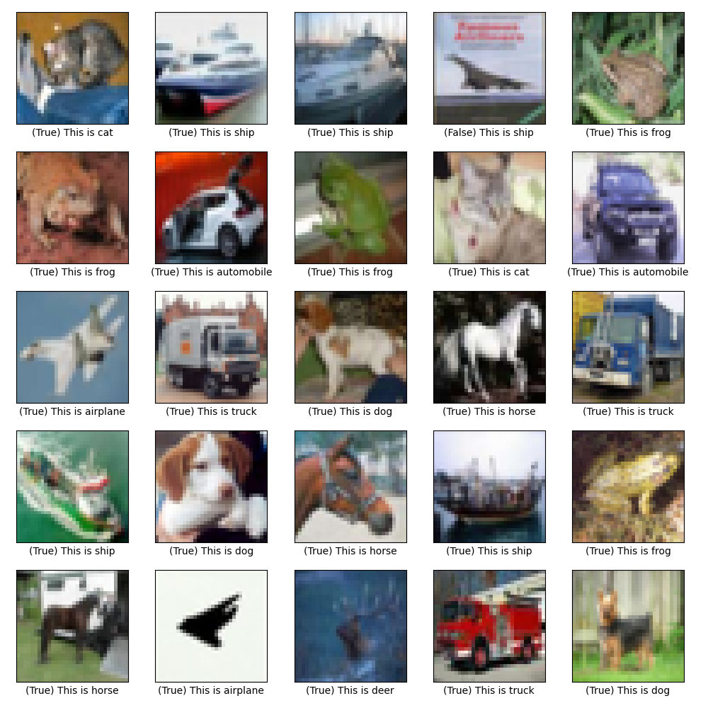
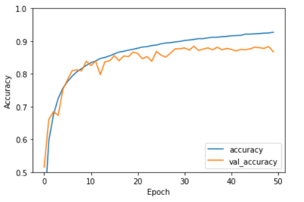
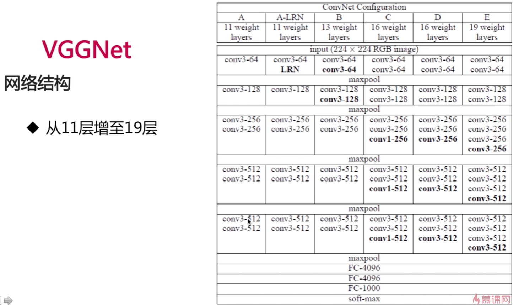

### cnn_cifar10_image_classification ###
This project applies Keras to build a Convolutional Neural Network, which achieves image classification on cifar_10 dataset with 88.5% accuracy on testset.



### Introduction ###
The ```trained_models``` directory comtains weights for trained models.
If you execute the ```train.py``` file, the weights file will be sotred in ```models``` directory.
### Prerequisites ###
1. Python3
2. Python-Tensorflow
3. Python-Keras
4. Python-Numpy
5. Python-Matplotlib
### Getting Started ###
Once this project is installed on your machine, go the ```train.py``` and type the line below on the terminal to lunch the game

       python train.py 
You can then go to ```test.py``` and load your trained weights by edit ```weights_path``` and type the line below on the terminal

       python test.py
### Author ###
Ivan Chen

